# 优秀产品经理成长指南：从新手到专家的完整进阶之路

> **导读**：在移动互联网进入存量竞争的今天，产品经理这个角色比以往任何时候都更加重要。本文系统梳理了产品经理从新手到专家的成长路径、核心能力模型和实战方法论，结合 35+ 真实案例深度解析，希望能给正在路上的你一些启发。全文约 15000 字，建议收藏后慢慢阅读。

---

## 目录

1. [成长路径：5 个阶段清晰规划](#一成长路径 5-个阶段清晰规划)
2. [第一性原理：回归本质的思考方式](#二第一性原理回归本质的思考方式)
3. [用户共情：理解用户真正的痛点](#三用户共情理解用户真正的痛点)
4. [核心能力模型：8 大能力缺一不可](#四核心能力模型 8-大能力缺一不可)
5. [数据分析：用数据驱动决策](#五数据分析用数据驱动决策)
6. [AI 时代：产品经理的新能力要求](#六 ai 时代产品经理的新能力要求)
7. [经典案例深度解析](#七经典案例深度解析)
8. [实战建议：6 条黄金法则](#八实战建议 6-条黄金法则)
9. [国内消费者洞察](#九国内消费者洞察)
10. [书单与资源推荐](#十书单与资源推荐)

---

## 一、成长路径：5 个阶段清晰规划

产品经理的成长不是一蹴而就的，而是需要经历从认知建立到战略思维的完整进阶。根据对数百位优秀产品经理的成长轨迹研究，我们总结出了以下 5 个发展阶段：

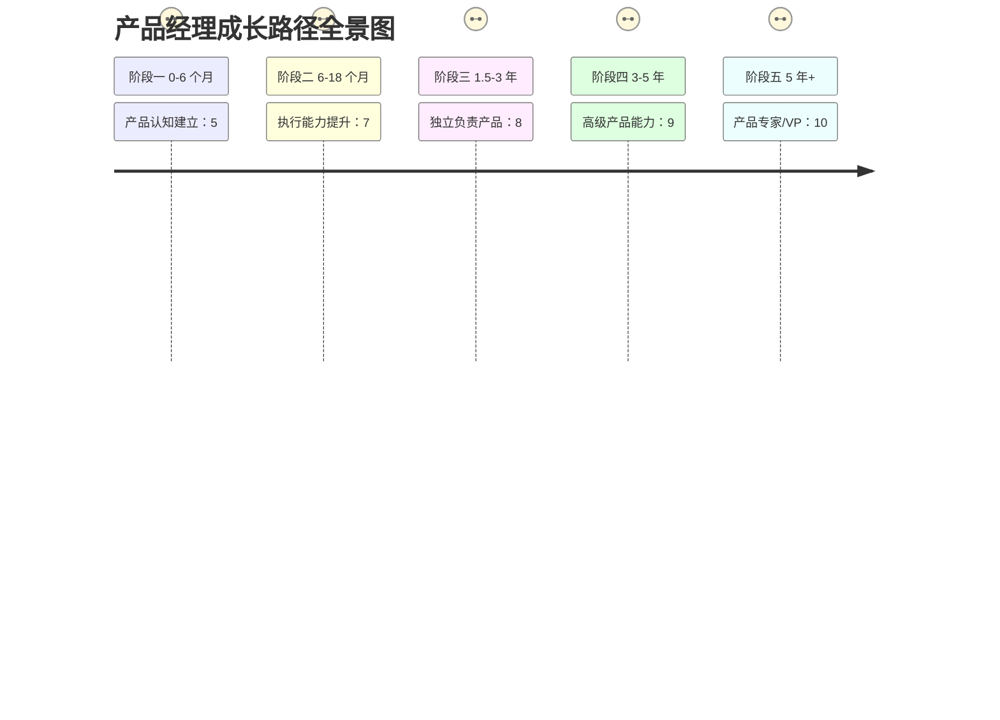

### 阶段一：产品认知建立（0-6 个月）

**核心定位**：新手入门期，建立对产品和产品工作的基本认知

**能力要求**：
- 理解产品生命周期：从需求发现到产品上线再到迭代优化的完整流程
- 基础用户研究：能够独立开展用户访谈，整理用户需求
- 需求文档撰写：掌握 PRD 文档的标准结构和写作规范
- 基础原型工具：熟练使用 Axure、Figma 或墨刀等原型工具

**核心任务清单**：
| 任务 | 数量要求 | 完成标准 |
|------|----------|----------|
| 全流程参与产品 | 1 个 | 从需求到上线完整跟进 |
| 独立撰写需求文档 | 5+ 份 | 通过评审并开发上线 |
| 用户访谈 | 10+ 次 | 形成完整访谈报告 |
| 原型设计 | 3+ 个 | 高保真可交互原型 |

**常见陷阱**：
- 过度关注功能细节，忽视业务目标
- 文档写得过于冗长，开发看不下去
- 不敢拒绝需求，成为"需求传声筒"
- 缺乏主动沟通，等问题暴露才上报

**成长建议**：这个阶段最重要的是**多问、多看、多练**。多向资深产品同事请教，多参与需求评审会议，多动手画原型写文档。不要怕犯错，每个错误都是成长的机会。

---

### 阶段二：执行能力提升（6-18 个月）

**核心定位**：独立执行期，能够独立负责功能模块的完整交付

**能力要求**：
- 版本规划能力：能够合理规划迭代节奏，平衡需求优先级
- 跨部门协作：与设计、开发、测试、运营等角色高效配合
- 项目管理：掌握敏捷开发流程，把控项目进度和风险
- 数据分析：建立数据监控体系，用数据驱动产品优化

**核心任务清单**：
| 任务 | 数量要求 | 完成标准 |
|------|----------|----------|
| 独立负责功能模块 | 1-2 个 | 完整规划并持续迭代 |
| 主导需求评审会议 | 3+ 次 | 顺利通过评审 |
| 建立数据监控体系 | 1 套 | 覆盖核心指标 |
| 完成 A/B 测试 | 1+ 次 | 全流程执行并产出结论 |

**常见陷阱**：
- 追求完美，导致迭代速度过慢
- 过度承诺，无法按时交付
- 忽视技术可行性，方案难以落地
- 数据意识薄弱，凭感觉做决策

**成长建议**：这个阶段要培养**结果导向**的思维。不仅要能把功能做出来，更要关注功能上线后的实际效果。学会用数据说话，建立自己的数据监控看板，定期复盘功能表现。

---

### 阶段三：独立负责产品（1.5-3 年）

**核心定位**：独当一面期，能够独立负责一条完整产品线

**能力要求**：
- 产品策略制定：能够制定产品的中长期发展规划
- Roadmap 规划：合理规划产品演进路线，平衡短期和长期目标
- 竞品分析：深入理解竞争格局，找到差异化定位
- 团队管理：能够带领 2-3 人的小团队

**核心任务清单**：
| 任务 | 数量要求 | 完成标准 |
|------|----------|----------|
| 独立负责产品线 | 1 条 | 对整体指标负责 |
| 制定产品规划 | 季度/年度 | 获得管理层认可 |
| 带领小团队 | 2-3 人 | 团队高效运转 |
| 建立产品指标体系 | 1 套 | 覆盖业务全链路 |

**常见陷阱**：
- 陷入日常事务，缺乏战略思考
- 过度关注竞品，忽视用户真实需求
- 团队管理不当，内耗严重
- 与上级沟通不足，方向偏离

**成长建议**：这个阶段要完成从**执行者到规划者**的转变。学会站在更高的视角看问题，理解公司的商业目标，平衡用户体验和商业价值。同时开始培养自己的方法论，形成可复用的工作框架。

---

### 阶段四：高级产品能力（3-5 年）

**核心定位**：战略参与期，参与公司级产品战略制定

**能力要求**：
- 战略规划：参与制定公司整体产品战略
- 商业分析：深入理解商业模式和盈利逻辑
- 组织影响：能够影响和推动跨部门协作
- 创新突破：推动产品创新项目落地

**核心任务清单**：
| 任务 | 数量要求 | 完成标准 |
|------|----------|----------|
| 参与公司战略 | 1+ 次 | 贡献关键洞察 |
| 推动创新项目 | 1+ 个 | 成功落地并产生价值 |
| 建立最佳实践 | 1 套 | 在团队内推广 |
| 培养初级产品 | 2+ 人 | 帮助其快速成长 |

**常见陷阱**：
- 脱离一线，决策脱离实际
- 过度追求创新，忽视基础体验
- 组织政治消耗过多精力
- 知识更新滞后，跟不上行业变化

**成长建议**：这个阶段要培养**商业敏感度**和**组织影响力**。不仅要懂产品，更要懂业务、懂市场、懂组织。学会在复杂的组织环境中推动事情落地，同时保持对行业的敏感度，持续学习新知识。

---

### 阶段五：产品专家/VP（5 年+）

**核心定位**：行业影响期，制定公司整体产品战略，搭建产品团队和文化

**能力要求**：
- 战略思维：能够制定公司长期产品战略
- 组织建设：搭建高效的产品团队和文化
- 商业敏感：敏锐洞察市场机会和威胁
- 行业影响：在行业内建立个人影响力

**核心任务清单**：
| 任务 | 数量要求 | 完成标准 |
|------|----------|----------|
| 制定产品战略 | 公司级 | 支撑业务长期发展 |
| 搭建产品团队 | 完整体系 | 人才梯队健全 |
| 推动业务创新 | 1+ 个方向 | 开辟新增长曲线 |
| 建立行业影响力 | 持续输出 | 演讲、文章、出版等 |

**常见陷阱**：
- 过度关注战略，忽视执行细节
- 团队建设不当，核心人才流失
- 与市场脱节，战略方向错误
- 个人品牌过度包装，实际能力不足

**成长建议**：这个阶段的核心是**传承和影响力**。不仅要自己成功，更要帮助更多人成功。建立产品方法论体系，培养下一代产品领导者，在行业内建立自己的影响力。

---

## 二、第一性原理：回归本质的思考方式

第一性原理（First Principles）是产品经理最重要的思维工具之一。这个概念源于古希腊哲学，后来被埃隆·马斯克发扬光大。它要求我们**剥离表面现象，找到核心本质，从零开始构建解决方案**，而不是类比或借鉴现有方案。

### 什么是第一性原理？

第一性原理的思维方式可以概括为：

1. **识别问题**：明确要解决的问题是什么
2. **剥离表象**：去掉所有表面的、非本质的因素
3. **追问本质**：连续问"为什么"，直到找到最基本的要素
4. **重新构建**：从基本要素出发，设计全新的解决方案
5. **验证迭代**：用实践检验方案，持续优化

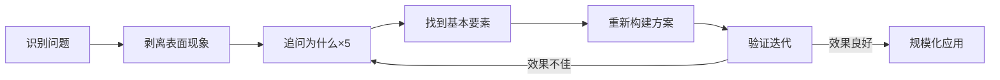

### 与类比思维的区别

| 维度 | 类比思维 | 第一性原理 |
|------|----------|------------|
| 思考起点 | "别人怎么做" | "问题本质是什么" |
| 解决方案 | 借鉴已有方案 | 从零开始构建 |
| 创新程度 | 渐进式改进 | 颠覆式创新 |
| 适用场景 | 成熟市场 | 新兴市场/红海突围 |
| 风险程度 | 较低 | 较高 |
| 回报潜力 | 有限 | 巨大 |

**类比思维的局限**：
- 容易陷入惯性思维
- 难以实现突破性创新
- 在红海市场中容易内卷
- 忽视用户真实需求

**第一性原理的优势**：
- 突破思维定式
- 发现全新机会
- 创造差异化价值
- 回归用户价值

---

### 经典案例深度解析

#### 案例一：乔布斯重新定义手机

**背景**：2005 年，智能手机市场已经被诺基亚、黑莓等巨头垄断。这些手机都有物理键盘，功能越来越多，但用户体验越来越复杂。

**类比思维**：其他厂商在想"手机应该增加什么功能"，于是不断添加键盘按键、增加菜单层级。

**第一性原理思考**：乔布斯问的是"手机最本质的功能是什么"。他的答案是：
- 通讯：打电话、发信息
- 信息获取：浏览网页、看邮件
- 娱乐：听音乐、看视频

基于这个本质理解，乔布斯做出了颠覆性决策：
- **去掉所有物理按键**：既然屏幕可以显示任何内容，为什么需要固定功能的按键？
- **最大化屏幕体验**：把手机正面全部做成屏幕
- **多点触控交互**：用手指直接操作，而不是用触控笔

**结果**：2007 年 iPhone 发布，重新定义了手机，开启了智能手机时代。

**启示**：不要被现有产品形态束缚，回归用户需求的本质，敢于打破常规。

---

#### 案例二：马斯克颠覆航天业

**背景**：2000 年代初，航天发射成本极高，一次发射动辄数亿美元。所有人都认为"火箭就是这么贵"。

**类比思维**：其他航天公司都在想"如何优化现有火箭设计，降低成本 10%-20%"。

**第一性原理思考**：马斯克问的是"火箭的本质是什么，为什么这么贵"。他拆解了火箭的成本结构：

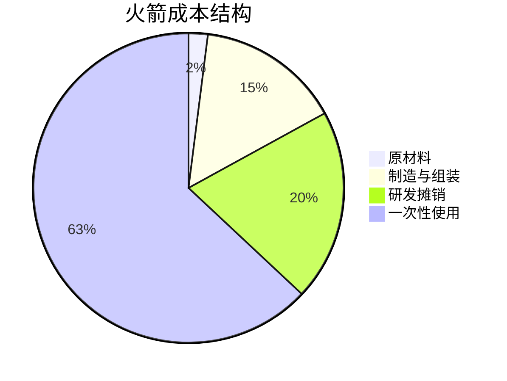

他发现：
- 原材料成本只占 2%
- 最大的成本是火箭只能使用一次
- 如果能回收复用，成本可以降低 90% 以上

基于这个洞察，SpaceX 做出了颠覆性决策：
- **研发可回收火箭**：猎鹰 9 号一级火箭可回收复用
- **不锈钢替代碳纤维**：星舰使用不锈钢，成本更低、强度更高
- **垂直整合**：自己生产 80% 的零部件，避免供应商溢价

**结果**：SpaceX 将发射成本降低了 10 倍以上，彻底颠覆了航天业。

**启示**：成本结构分析是第一性原理的重要工具。拆解成本，找到最大的浪费点，针对性优化。

---

#### 案例三：拼多多找到被忽视的市场

**背景**：2015 年，电商市场已经被淘宝、京东垄断。传统思维认为"电商格局已定，没有机会了"。

**类比思维**：其他电商创业者在想"如何做一个更好的淘宝/京东"。

**第一性原理思考**：黄峥问的是"中国还有哪些用户没有被服务好"。他的洞察：
- 中国有 5 亿低收入人群（月收入 1000 元以下）
- 这些用户对价格极度敏感，对品牌不敏感
- 他们有强烈的"占便宜"心理需求
- 微信社交关系链没有被电商充分利用

基于这个洞察，拼多多做出了差异化决策：
- **拼团模式**：用户发起拼团，分享给好友，一起买更便宜
- **极致低价**：压缩渠道层级，直接对接工厂（C2M）
- **微信裂变**：利用微信社交关系链，让用户自发传播
- **游戏化体验**：多多果园、砍一刀等玩法，提升用户粘性

**结果**：拼多多用 3 年时间做到 5 亿用户，市值超越京东。

**启示**：不要在巨头擅长的领域正面竞争。找到被忽视的细分人群，用创新的产品形态满足他们的特殊需求。

---

### 第一性原理的日常应用

#### 应用场景一：购物决策

面对"要不要买某款产品"时，用第一性原理思考：

1. **识别问题**：我为什么要买这个产品？
2. **追问本质**：我真正需要的是什么？
3. **剥离溢价**：这个价格中有多少是品牌溢价？
4. **寻找替代**：有没有更本质的解决方案？

**示例**：
- 问题：要不要买 3000 元的戴森吹风机？
- 本质需求：快速吹干头发 + 不伤发
- 分析：戴森的核心技术是高速马达 + 温控，但国产品牌也有类似技术
- 决策：如果预算有限，可以选择 500 元的国产品牌，核心功能相同

---

#### 应用场景二：职业选择

面对职业困惑时，用第一性原理思考：

1. **识别问题**：我为什么要换工作？
2. **追问本质**：我工作的核心目的是什么？
3. **剥离期待**：哪些是社会期待，哪些是我真正想要的？
4. **重新构建**：什么样的工作能帮我达成核心目标？

**示例**：
- 问题：要不要从大厂跳槽到创业公司？
- 本质需求：个人成长 + 财务回报 + 工作意义
- 分析：大厂稳定但成长慢，创业公司风险高但成长快
- 决策：如果核心目标是快速成长，且能承受风险，选择创业公司

---

#### 应用场景三：产品设计

做产品时，用第一性原理思考：

1. **识别问题**：用户真正想要的是什么？
2. **追问本质**：这个需求的本质是什么？
3. **剥离惯性**：有没有更好的解决方案？
4. **重新构建**：从基本要素出发设计新方案

**示例**：
- 问题：如何提升用户留存率？
- 本质需求：用户留存的核心是"持续获得价值"
- 分析：现有功能是否持续提供价值？用户是否感知到价值？
- 决策：优化核心价值传递，而不是添加更多功能

---

### 第一性原理思考步骤详解

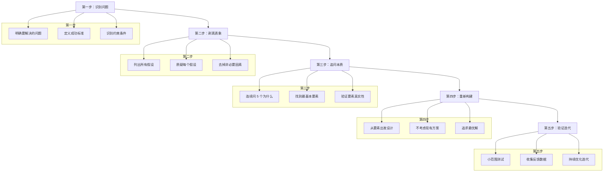

**第一步：识别问题**
- 明确要解决的问题是什么
- 定义成功的标准
- 识别约束条件（时间、资源、技术等）

**第二步：剥离表象**
- 列出所有关于这个问题的假设
- 逐一质疑每个假设："这一定是真的吗？"
- 去掉所有非必要的因素

**第三步：追问本质**
- 连续问至少 5 个"为什么"
- 找到最基本的、不可再分的要素
- 验证这些要素是否真实可靠

**第四步：重新构建**
- 从基本要素出发，设计全新方案
- 不考虑现有方案的限制
- 追求理论上的最优解

**第五步：验证迭代**
- 小范围测试新方案
- 收集反馈和数据
- 持续优化迭代

---

### 产品经理的第一性原理

作为产品经理，运用第一性原理时要特别关注以下几点：

**1. 回归用户价值**
- 用户真正想要的是什么？
- 这个功能是否创造了真实价值？
- 有没有更简单的方式实现同样的价值？

**2. 追问真实需求**
- 用户说的需求是表面还是本质？
- 这个需求背后还有什么更深层的动机？
- 如果这个需求不存在，用户会怎么做？

**3. 创造而非模仿**
- 竞品这么做，是否适合我们？
- 有没有完全不同的解决方案？
- 如果能从零开始，我会怎么设计？

**4. 挑战行业惯例**
- 这个行业为什么是这样？
- 这个惯例还有存在的必要吗？
- 如果打破这个惯例，会发生什么？

---

## 三、用户共情：理解用户真正的痛点

共情（Empathy）是产品经理最核心的能力之一。它不是"我觉得用户需要什么"，而是**站在用户的角度，感受他们的情绪，理解他们的需求，看见他们真正的痛点**。

### 共情 vs 同理心

很多人混淆"共情"和"同理心"，两者有细微但重要的区别：

| 维度 | 同理心（Empathy） | 共情（Compassion） |
|------|-------------------|-------------------|
| 定义 | 理解他人的处境和感受 | 理解 + 感受 + 行动意愿 |
| 层次 | 认知层面 | 认知 + 情感 + 行为 |
| 表现 | "我理解你的感受" | "我感受到你的感受，并想帮助你" |
| 产品经理应用 | 理解用户为什么这么做 | 理解 + 感受 + 设计解决方案 |

**产品经理需要两者结合**：
- 理解用户行为背后的原因（同理心）
- 感受用户在使用产品时的情绪（共情）
- 基于理解设计更好的解决方案（行动）

---

### 用户说 vs 用户做

这是产品经理最容易犯的错误：**把用户说的当成用户做的**。

**用户说的**往往是：
- 他们的期望和愿望
- 他们认为"应该"的答案
- 他们想呈现给别人的形象

**用户做的**才是：
- 他们的真实行为
- 他们的实际选择
- 他们的真实偏好

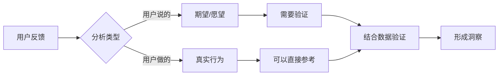

**经典案例**：

**案例一：用户说"我想要更多功能"，但数据表明功能越多流失越高**
- 用户说的：希望产品有更多功能
- 用户做的：功能越多，越找不到核心功能，流失率越高
- 洞察：用户真正需要的是"快速完成核心任务"，而不是"更多功能"

**案例二：用户说"我不在乎价格"，但转化率数据显示价格敏感**
- 用户说的：价格不是问题，质量最重要
- 用户做的：价格提高 10%，转化率下降 50%
- 洞察：用户希望"感觉占了便宜"，而不是真的不在乎价格

**案例三：用户说"我会分享这个功能"，但分享率不到 1%**
- 用户说的：这个功能太好了，我一定会分享
- 用户做的：99% 的用户没有分享
- 洞察：用户"想要成为会分享的人"，但实际没有分享动机

---

### 共情工具一：同理心地图

同理心地图（Empathy Map）是还原用户全貌的有效工具。它帮助你从多个维度理解用户：

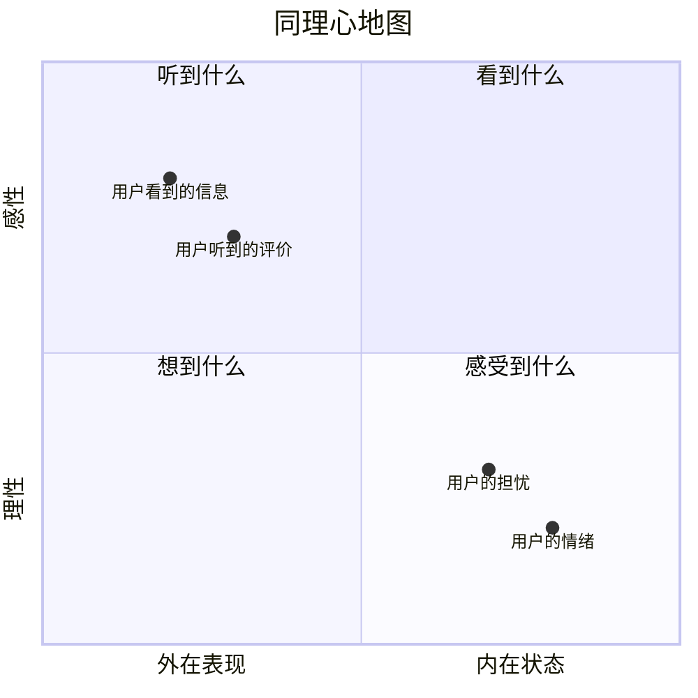

**完整的同理心地图包含 8 个维度**：

| 维度 | 问题 | 示例（在线购物场景） |
|------|------|---------------------|
| 看到什么 | 用户看到什么信息？ | 商品图片、价格、评价、促销活动 |
| 听到什么 | 用户听到什么声音？ | 朋友推荐、KOL 测评、客服介绍 |
| 说什么/做什么 | 用户公开表达什么？ | "这个价格太贵了"、"我再看看别的" |
| 想什么 | 用户内心想什么？ | "真的值这个价吗"、"会不会被坑" |
| 感受到什么 | 用户的情绪是什么？ | 犹豫、担心、期待、兴奋 |
| 痛点 | 用户的困难是什么？ | 怕买贵、怕质量差、怕售后麻烦 |
| 收获 | 用户的期望收益是什么？ | 买到好东西、占便宜、被认可 |
| 行为 | 用户实际怎么做？ | 比价、看评价、加入购物车犹豫 |

**如何使用同理心地图**：

1. **选择目标用户**：明确你要理解的是哪类用户
2. **收集信息**：通过访谈、观察、数据等方式收集信息
3. **填充地图**：将信息归类到 8 个维度
4. **发现洞察**：寻找矛盾点（说的 vs 想的 vs 做的）
5. **形成方案**：基于洞察设计解决方案

---

### 共情工具二：用户旅程地图

用户旅程地图（User Journey Map）是绘制用户从发现产品到离开产品全流程的工具，帮助你找到体验低谷和高峰。

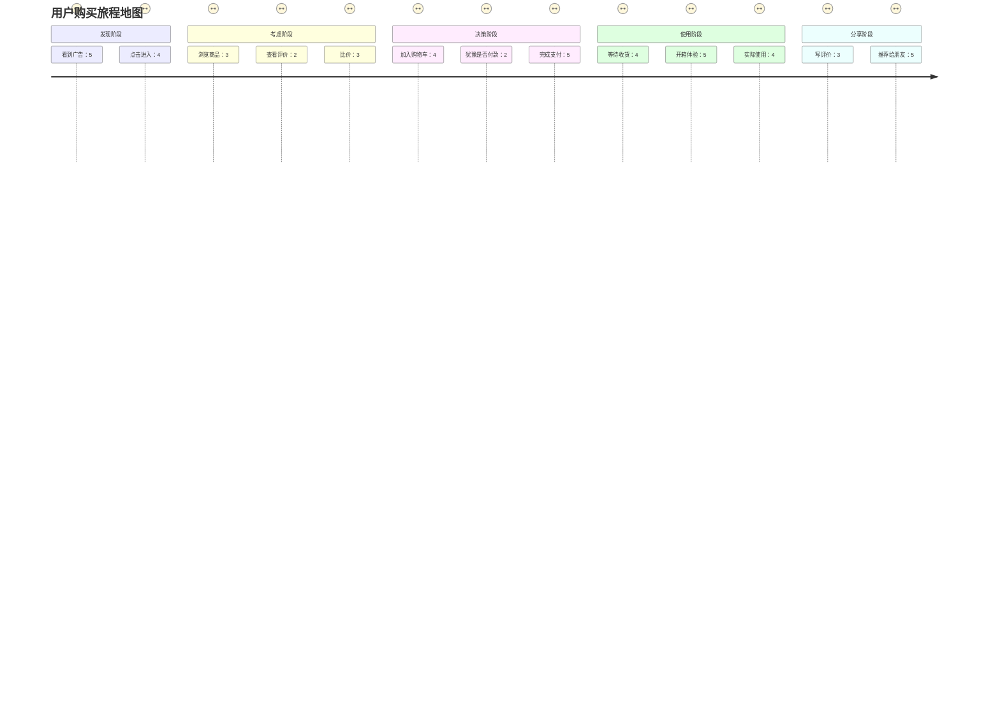

**用户旅程地图的核心要素**：

| 要素 | 说明 | 示例 |
|------|------|------|
| 阶段 | 用户旅程的关键阶段 | 发现、考虑、决策、使用、分享 |
| 触点 | 用户与产品的接触点 | 广告、落地页、商品页、支付页 |
| 行为 | 用户在每个触点的行为 | 点击、浏览、加购、支付 |
| 情绪 | 用户的情绪曲线 | 好奇→犹豫→焦虑→满足→自豪 |
| 痛点 | 每个阶段的问题 | 加载慢、信息不全、流程复杂 |
| 机会 | 可优化的点 | 简化流程、增加信任背书 |

**如何绘制用户旅程地图**：

1. **定义用户**：明确你要绘制的是哪类用户
2. **划分阶段**：将旅程划分为 5-7 个关键阶段
3. **识别触点**：列出每个阶段的所有触点
4. **记录行为**：描述用户在每个触点的行为
5. **绘制情绪**：用曲线表示用户情绪变化
6. **标记痛点**：找出情绪低谷和体验问题
7. **发现机会**：针对痛点设计优化方案

---

### 共情工具三：用户访谈技巧

用户访谈是获取用户洞察最直接的方式，但很多产品经理的访谈技巧有待提升。

**访谈前的准备**：

| 准备项 | 说明 | 示例 |
|--------|------|------|
| 明确目标 | 这次访谈要解决什么问题？ | 了解用户为什么流失 |
| 招募用户 | 选择有代表性的用户 | 近 30 天流失的活跃用户 |
| 设计提纲 | 准备开放式问题清单 | "能讲讲你最后一次使用的经历吗" |
| 准备设备 | 录音、录像、笔记工具 | 录音笔、笔记本 |
| 预演练习 | 找同事模拟访谈 | 发现问题的表述是否清晰 |

**访谈中的技巧**：

**1. 开放式提问**
- ❌ "你觉得这个功能好用吗？"（封闭式）
- ✅ "能讲讲你是怎么使用这个功能的吗？"（开放式）

**2. 追问细节**
- "能具体讲讲当时的情况吗？"
- "你当时是怎么想的？"
- "然后呢？发生了什么？"

**3. 沉默的力量**
- 用户说完后，停顿 3-5 秒
- 用户往往会补充更多信息

**4. 复述确认**
- "我理解的是...对吗？"
- 确保你没有误解用户

**5. 观察非语言信息**
- 表情、语气、肢体动作
- 这些往往比语言更真实

**访谈后的分析**：

1. **整理记录**：24 小时内整理访谈记录
2. **提取原话**：记录用户的原话，尤其是情绪化表达
3. **寻找模式**：多个用户提到的共同点
4. **形成洞察**：从现象到本质的提炼
5. **指导行动**：将洞察转化为产品决策

---

### 变成用户：亲身体验的力量

最好的共情方式是**亲自成为用户**，在真实场景中使用自己的产品。

**具体做法**：

1. **完整使用流程**
   - 从注册到核心功能使用，完整走一遍
   - 记录每个步骤的感受和问题

2. **卸载再安装**
   - 从新用户视角重新体验
   - 发现你习以为常但新用户困惑的点

3. **观察不同人群**
   - 观察爸妈、小朋友怎么使用
   - 发现你意识不到的障碍

4. **极端场景测试**
   - 网络不好时、电量低时、着急时
   - 这些场景下体验问题会被放大

5. **竞品对比体验**
   - 同时使用竞品
   - 发现你的产品与竞品的差异

**经典案例**：

**微信张小龙**：据说张小龙每天都会花大量时间体验微信，包括深夜。他能敏锐地发现体验问题，比如"为什么这个按钮要放在这里"、"这个交互是否自然"。

**乔布斯**：乔布斯对产品的细节要求极高，他会反复体验每个交互，直到"感觉对了"为止。

---

### 避免共情陷阱

**陷阱一：把自己当用户**
- 问题：你不是用户，你的需求不代表用户需求
- 解决：建立用户画像，明确目标用户群体

**陷阱二：过度认同用户**
- 问题：用户说的都是对的吗？用户要什么就给什么吗？
- 解决：区分"用户说的"和"用户需要的"，保持专业判断

**陷阱三：样本偏差**
- 问题：访谈的用户有代表性吗？
- 解决：多样化样本，结合定量数据验证

**陷阱四：情绪感染**
- 问题：过度共情导致失去客观判断
- 解决：保持适度距离，理性分析

**陷阱五：贴标签**
- 问题：用"90 后"、"小镇青年"等标签简化用户
- 解决：深入理解个体，避免刻板印象

---

## 四、核心能力模型：8 大能力缺一不可

根据对数百位优秀产品经理的能力分析，我们总结出了以下 8 大核心能力：

```mermaid
radar
    title 产品经理核心能力雷达图
    axis productThinking["产品思维"], userInsight["用户洞察"], dataAnalysis["数据分析"], productDesign["产品设计"], communication["沟通协作"], projectMgmt["项目管理"], strategicThinking["战略思维"], innovation["创新能力"]
    curve junior[新手 PM]{6,7,4,6,5,4,3,4}
    curve senior[资深 PM]{8,8,7,8,8,8,6,7}
    curve expert[专家 PM]{9,9,8,9,9,9,9,9}
```

### 能力一：产品思维

**定义**：结构化思考，系统化解决问题，从全局视角看待产品

**核心要素**：
- **系统性思维**：将产品视为一个系统，理解各要素之间的关系
- **批判性思考**：不盲从，不人云亦云，独立思考判断
- **本质思维**：透过现象看本质，找到问题的根本原因
- **全局视角**：不仅关注功能，更关注业务、技术、组织的协同

**如何培养**：
1. 学习系统论、控制论等基础理论
2. 多用框架思考（如 SWOT、PEST、波特五力）
3. 养成画思维导图、流程图的习惯
4. 定期复盘，总结规律

---

### 能力二：用户洞察

**定义**：深入理解用户需求，发现真实痛点，创造用户价值

**核心要素**：
- **用户访谈**：掌握深度访谈技巧，获取真实洞察
- **行为分析**：通过数据分析理解用户行为模式
- **同理心地图**：还原用户全貌，理解用户所思所想所感
- **用户画像**：建立清晰的目标用户画像

**如何培养**：
1. 每周至少进行 1 次用户访谈
2. 养成看数据的习惯，每天关注核心指标
3. 建立用户反馈收集机制
4. 定期写用户洞察笔记

---

### 能力三：数据分析

**定义**：数据驱动决策，用数据验证假设，发现增长机会

**核心要素**：
- **指标体系**：建立完整的产品指标体系
- **SQL 查询**：能够自助取数，不依赖数据团队
- **归因分析**：找到影响指标的关键因素
- **实验设计**：设计 A/B 测试验证假设

**如何培养**：
1. 学习 SQL 基础（SELECT、WHERE、GROUP BY、JOIN）
2. 掌握数据分析工具（Excel、Python、Tableau）
3. 学习统计学基础（假设检验、置信区间）
4. 多做 A/B 测试，积累实验经验

---

### 能力四：产品设计

**定义**：从概念到原型，打造优秀用户体验，设计创新解决方案

**核心要素**：
- **交互设计**：设计流畅、自然的交互流程
- **信息架构**：合理组织信息，让用户快速找到所需内容
- **原型工具**：熟练使用 Figma、Axure 等工具
- **设计原则**：掌握一致性、简洁性、可用性等设计原则

**如何培养**：
1. 学习设计基础（格式塔原理、色彩理论）
2. 熟练使用至少一款原型工具
3. 多体验优秀产品，积累设计感
4. 学习《About Face》《设计心理学》等经典书籍

---

### 能力五：沟通协作

**定义**：有效传达产品价值，协调各方资源，推动项目落地

**核心要素**：
- **需求评审**：清晰表达需求，有效应对质疑
- **跨部门协作**：与设计、开发、测试、运营高效配合
- **演讲表达**：能够向不同受众清晰表达观点
- **冲突管理**：有效处理分歧，达成共识

**如何培养**：
1. 练习结构化表达（金字塔原理）
2. 学习非暴力沟通技巧
3. 多参与公开演讲，提升表达能力
4. 建立良好的人际关系网络

---

### 能力六：项目管理

**定义**：有效规划资源，管理风险，确保项目按时高质量交付

**核心要素**：
- **敏捷方法**：掌握 Scrum、Kanban 等敏捷方法
- **优先级排序**：使用 RICE、MoSCoW 等方法排序需求
- **风险管理**：识别风险，制定应对方案
- **进度把控**：有效跟踪进度，及时发现问题

**如何培养**：
1. 学习项目管理基础（PMP 知识体系）
2. 考取 PMP 或 CSM 认证
3. 使用项目管理工具（Jira、Trello）
4. 多负责项目，积累实战经验

---

### 能力七：战略思维

**定义**：从商业角度思考产品，制定长期发展规划，平衡多方利益

**核心要素**：
- **商业分析**：理解商业模式和盈利逻辑
- **竞争格局**：深入理解市场竞争态势
- **增长策略**：制定可持续的增长策略
- **长期主义**：平衡短期目标和长期价值

**如何培养**：
1. 学习商业分析框架（商业模式画布等）
2. 关注行业动态，理解竞争格局
3. 学习战略管理理论
4. 参与公司战略规划，积累经验

---

### 能力八：创新能力

**定义**：突破思维定式，发现新机会，创造差异化产品价值

**核心要素**：
- **创新方法**：掌握设计思维、TRIZ 等创新方法
- **实验思维**：快速试错，从失败中学习
- **快速迭代**：小步快跑，持续优化
- **跨界学习**：从其他领域汲取灵感

**如何培养**：
1. 学习创新方法论
2. 保持好奇心，广泛涉猎
3. 建立创意库，随时记录灵感
4. 多参与创新项目，积累实战经验

---

## 五、数据分析：用数据驱动决策

数据是产品优化的依据，是决策的底气。**凭感觉做产品是赌博，用数据说话是专业。** 产品经理要用数据验证假设，用数据发现机会，用数据支撑决策。

### 为什么需要数据分析

**1. 验证产品假设**
- 你认为用户需要这个功能，数据能告诉你是否真的需要
- 你认为这个改动能提升转化，数据能告诉你是否真的提升

**2. 发现增长机会**
- 数据能告诉你哪个渠道的获客成本最低
- 数据能告诉你哪个功能的使用频率最高
- 数据能告诉你哪个环节的用户流失最严重

**3. 支撑决策依据**
- 用数据说服老板和团队
- 用数据证明你的决策是正确的
- 用数据减少无谓的争论

**4. 监控产品健康**
- 实时监控核心指标，及时发现问题
- 建立预警机制，防患于未然
- 定期复盘，持续优化

---

### 核心指标体系：AARRR 海盗模型

AARRR 模型是互联网公司最常用的指标框架，由 Dave McClure 提出：

```mermaid
funnel
    title AARRR 海盗模型
    "获取 Acquisition" : 10000
    "激活 Activation" : 6000
    "留存 Retention" : 3000
    "收入 Revenue" : 1000
    "推荐 Referral" : 300
```

**1. 获取（Acquisition）**
- 定义：用户如何发现你
- 核心指标：UV、PV、获客成本（CAC）、渠道转化率
- 关键问题：哪个渠道的获客成本最低？哪个渠道的用户质量最高？

**2. 激活（Activation）**
- 定义：用户是否获得良好第一印象
- 核心指标：注册率、激活率、核心功能使用率
- 关键问题：用户是否完成了关键行为？是否体验到产品价值？

**3. 留存（Retention）**
- 定义：用户是否会回来
- 核心指标：次日留存、7 日留存、30 日留存、DAU/MAU
- 关键问题：用户为什么流失？如何提高留存率？

**4. 收入（Revenue）**
- 定义：用户是否愿意付费
- 核心指标：付费率、ARPU、ARPPU、LTV
- 关键问题：用户为什么付费？如何提高客单价？

**5. 推荐（Referral）**
- 定义：用户是否愿意推荐
- 核心指标：NPS、K 因子、病毒系数
- 关键问题：用户为什么推荐？如何降低推荐门槛？

---

### 北极星指标

**定义**：北极星指标（North Star Metric）是公司唯一最重要的指标，是产品成功的核心衡量标准。

**为什么需要北极星指标**：
- 统一团队目标，避免各自为战
- 聚焦资源，避免分散精力
- 衡量长期价值，避免短视行为

**经典案例**：

| 公司 | 北极星指标 | 说明 |
|------|------------|------|
| Facebook | 月活跃用户数 | 用户越多，网络效应越强 |
| Airbnb | 预订夜数 | 直接反映平台交易规模 |
| Uber | 完成订单数 | 订单越多，平台价值越大 |
| 微信 | 日活跃用户数 | 用户越多，社交价值越大 |
| 拼多多 | GMV | 交易规模是电商的核心 |
| 抖音 | 用户时长 | 时长越长，广告价值越大 |

**如何选择北极星指标**：
1. 反映产品核心价值
2. 可衡量、可追踪
3. 团队可以影响
4. 长期可持续

---

### 常用指标分类

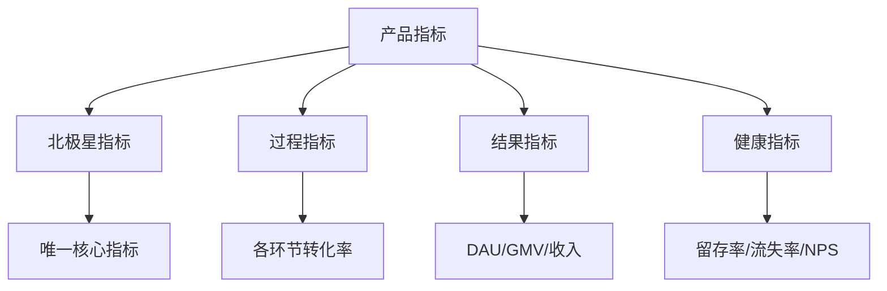

**1. 北极星指标**
- 唯一核心指标，代表产品成功
- 示例：日活跃用户数、GMV、订单量

**2. 过程指标**
- 衡量各环节的转化效率
- 示例：注册转化率、激活率、付费转化率

**3. 结果指标**
- 衡量最终业务结果
- 示例：DAU、GMV、收入、利润

**4. 健康指标**
- 衡量产品长期健康度
- 示例：留存率、流失率、NPS、用户满意度

---

### 数据埋点指南

**埋点是数据采集的基础**。没有准确的埋点，就没有可靠的数据分析。

**埋点设计原则**：

1. **明确目标**
   - 这个埋点要解决什么问题？
   - 谁会使用这个数据？
   - 如何使用这个数据？

2. **定义清晰**
   - 事件名称：简洁、明确、统一命名规范
   - 事件属性：记录所有可能用于分析的维度
   - 触发时机：明确什么时候触发埋点

3. **避免污染**
   - 只采集有用的数据
   - 避免重复埋点
   - 定期清理无效埋点

**埋点文档示例**：

| 事件名称 | 触发时机 | 事件属性 | 使用场景 |
|----------|----------|----------|----------|
| click_buy_button | 点击购买按钮 | 商品 ID、价格、来源页 | 购买转化分析 |
| complete_register | 完成注册 | 注册方式、邀请码、渠道 | 注册转化分析 |
| watch_video | 观看视频 | 视频 ID、观看时长、是否完播 | 内容消费分析 |

---

### SQL 基础查询

产品经理需要会基础 SQL，不求写复杂查询，但要能自助取数。

**高频 SQL 语句**：

```sql
-- 1. 基础查询
SELECT * FROM users WHERE created_at >= '2024-01-01';

-- 2. 条件过滤
SELECT user_id, name FROM users 
WHERE age >= 18 AND city = '北京';

-- 3. 分组聚合
SELECT date(created_at) as dt, count(*) as cnt 
FROM orders 
GROUP BY date(created_at);

-- 4. 多表关联
SELECT u.name, o.amount 
FROM users u 
JOIN orders o ON u.id = o.user_id;

-- 5. 排序和限制
SELECT user_id, sum(amount) as total 
FROM orders 
GROUP BY user_id 
ORDER BY total DESC 
LIMIT 10;
```

**学习建议**：
1. 先掌握 SELECT、WHERE、GROUP BY、JOIN
2. 在测试环境多练习
3. 学会看执行计划，优化查询性能
4. 了解公司数据仓库的表结构

---

### 漏斗分析

**漏斗分析帮你找到流失环节**。从曝光→点击→注册→激活→付费，每个环节的转化率是多少？哪里漏了？为什么漏？

```mermaid
funnel
    title 电商购买漏斗
    "商品曝光" : 100000
    "点击商品" : 50000
    "加入购物车" : 20000
    "发起支付" : 10000
    "完成支付" : 8000
```

**漏斗分析步骤**：

1. **定义关键步骤**
   - 用户完成目标需要经过哪些步骤？
   - 每个步骤的定义是什么？

2. **计算转化率**
   - 每个步骤的转化率是多少？
   - 与行业基准相比如何？

3. **定位流失原因**
   - 哪个环节流失最严重？
   - 为什么用户在这里流失？
   - 如何优化？

**优化示例**：

| 环节 | 转化率 | 问题 | 优化方案 |
|------|--------|------|----------|
| 曝光→点击 | 50% | 正常 | - |
| 点击→加购 | 40% | 价格偏高 | 增加优惠券、限时折扣 |
| 加购→支付 | 50% | 运费太高 | 满包邮、运费券 |
| 支付→完成 | 80% | 支付方式少 | 增加支付方式 |

---

### 留存分析

**留存是产品生命线**。没有留存，增长就是空中楼阁。

**留存类型**：

| 类型 | 定义 | 适用场景 |
|------|------|----------|
| 次日留存 | 第 2 天还在使用的用户比例 | 高频产品（社交、资讯） |
| 7 日留存 | 第 7 天还在使用的用户比例 | 中频产品（电商、O2O） |
| 30 日留存 | 第 30 天还在使用的用户比例 | 低频产品（旅游、房产） |

**Cohort 分析**：

```mermaid
xychart-beta
    title 不同月份用户留存对比
    x-axis [第 1 天，第 7 天，第 14 天，第 30 天]
    y-axis "留存率 %" 0 --> 100
    line [100, 60, 45, 35]
    line [100, 55, 40, 30]
    line [100, 50, 35, 25]
```

**留存分析关键问题**：
- 用户为什么流失？
- 流失前做了什么？
- 留存用户有什么共同特征？
- 如何提升留存率？

**提升留存的方法**：
1. 优化新用户引导（Onboarding）
2. 建立用户习惯（签到、推送）
3. 增加用户粘性（社交、内容）
4. 召回流失用户（短信、邮件、推送）

---

### A/B 测试

**用实验验证假设**。控制组 vs 实验组，唯一变量，长期观察。

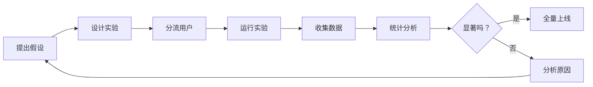

**A/B 测试关键要点**：

1. **明确实验假设**
   - 假设要具体、可衡量
   - 示例："将按钮颜色从蓝色改为红色，点击率提升 10%"

2. **分组要均匀**
   - 随机分流，确保两组用户特征一致
   - 样本量要足够大

3. **唯一变量**
   - 只改变一个因素，其他保持不变
   - 否则无法确定是哪个因素起作用

4. **等待统计显著**
   - p 值<0.05 才算显著
   - 不要过早下结论

5. **注意新奇效应**
   - 用户可能因为新鲜而点击，不是真的喜欢
   - 需要长期观察

**常见错误**：
- 样本量不足就下结论
- 同时改变多个变量
- 没有设置对照组
- 过早停止实验
- 忽略长期影响

---

### 常见数据陷阱

**陷阱一：相关不等于因果**

示例：数据显示"使用功能 A 的用户留存更高"，于是你大力推广功能 A。但真相可能是"高留存用户更可能探索新功能"，是留存高导致使用功能 A，而不是功能 A 导致留存高。

**解决**：用 A/B 测试验证因果关系，不要仅凭相关性做决策。

---

**陷阱二：幸存者偏差**

示例：你分析现有用户的特征，发现他们大多来自一线城市，于是你决定只投放一线城市。但真相可能是"二三线用户因为体验不好流失了"，你错失了更大的市场。

**解决**：不仅要看留存用户，更要看流失用户。

---

**陷阱三：虚荣指标**

示例：你为"累计用户突破 1000 万"而兴奋，但 DAU 只有 10 万，留存率只有 5%。累计用户数是虚荣指标，留存率才是健康指标。

**解决**：关注质量指标，而不是数量指标。

---

**陷阱四：平均数陷阱**

示例：平均用户时长 30 分钟，听起来不错。但真相可能是"10% 的用户每天用 3 小时，90% 的用户几乎不用"。平均数掩盖了极端值。

**解决**：看中位数、分位数，看分布而不是平均。

---

**陷阱五：数据说谎**

示例：数据显示"新版本上线后收入提升 20%"，但真相可能是"正好赶上促销活动"。数据没有说谎，但你解读错了。

**解决**：结合业务背景解读数据，不要孤立看数字。

---

### 数据驱动决策框架

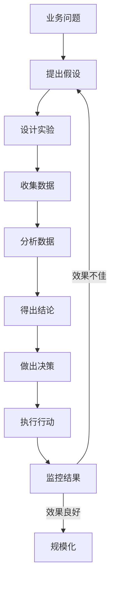

**关键原则**：

1. **洞察 + 验证**
   - 感性洞察提出假设
   - 理性数据验证假设
   - 两者结合才是最佳决策

2. **小步快跑**
   - 不要等完美方案
   - 快速实验，快速迭代
   - 从失败中学习

3. **持续学习**
   - 建立知识库
   - 沉淀经验教训
   - 持续优化决策质量

---

## 六、AI 时代：产品经理的新能力要求

AI 正在重塑产品形态，产品经理需要掌握新的能力。

### AI 技术理解

**需要掌握的核心概念**：

| 概念 | 说明 | 产品应用 |
|------|------|----------|
| 机器学习 | 让机器从数据中学习规律 | 推荐系统、风控模型 |
| 深度学习 | 用神经网络模拟人脑 | 图像识别、语音识别 |
| 自然语言处理 | 让机器理解和生成语言 | 智能客服、内容生成 |
| 计算机视觉 | 让机器"看懂"图像 | 人脸识别、图像搜索 |
| 大语言模型 | 基于海量文本训练的模型 | 智能助手、内容创作 |
| RAG 架构 | 检索增强生成 | 知识库问答、企业助手 |

**学习建议**：
1. 不需要会写代码，但要理解基本原理
2. 了解 AI 的能力边界和局限性
3. 关注 AI 领域的最新进展
4. 亲自体验主流 AI 产品

---

### AI 产品设计

**AI 产品与传统产品的区别**：

| 维度 | 传统产品 | AI 产品 |
|------|----------|---------|
| 确定性 | 确定性输出 | 概率性输出 |
| 可解释性 | 逻辑清晰 | 黑盒决策 |
| 错误处理 | 规则明确 | 需要容错 |
| 用户预期 | 功能稳定 | 可能"发挥" |

**AI 产品设计要点**：

1. **Prompt 设计**
   - 设计有效的提示词模板
   - 考虑上下文、角色、格式
   - 测试不同 Prompt 的效果

2. **人机协作**
   - AI 不是替代人，而是增强人
   - 设计 AI 与人的协作流程
   - 保留人的最终决策权

3. **容错机制**
   - AI 可能出错，需要兜底方案
   - 提供"不满意"反馈入口
   - 支持人工接管

4. **预期管理**
   - 明确告知用户 AI 的能力边界
   - 避免过度承诺
   - 管理用户预期

---

### 数据工程

**AI 产品的数据基础**：

| 环节 | 说明 | 产品经理关注点 |
|------|------|----------------|
| 数据采集 | 收集原始数据 | 数据质量、覆盖度 |
| 数据清洗 | 处理脏数据 | 数据准确性 |
| 数据标注 | 人工标注训练数据 | 标注规范、质量 |
| 特征工程 | 提取有效特征 | 特征与目标的相关性 |
| 模型训练 | 训练 AI 模型 | 模型效果评估 |
| 模型部署 | 上线运行 | 性能、稳定性 |

**产品经理的数据能力**：
1. 理解数据管道的基本流程
2. 能够定义数据标注规范
3. 能够评估数据质量
4. 能够与数据团队高效协作

---

### AI 伦理与合规

**AI 产品的伦理风险**：

| 风险类型 | 说明 | 应对方案 |
|----------|------|----------|
| 隐私泄露 | 用户数据被滥用 | 数据脱敏、最小化采集 |
| 算法歧视 | 对特定群体不公平 | 公平性测试、多样化数据 |
| 黑盒决策 | 无法解释决策原因 | 可解释 AI、人工审核 |
| 内容安全 | 生成有害内容 | 内容过滤、人工审核 |
| 依赖成瘾 | 过度依赖 AI | 使用提醒、健康引导 |

**合规要求**：
1. 遵守《个人信息保护法》
2. 遵守《生成式 AI 服务管理办法》
3. 建立 AI 伦理审查机制
4. 定期进行合规审计

---

## 七、经典案例深度解析

### 案例一：字节跳动——算法驱动的增长飞轮

**背景**：2012 年，今日头条创立时面临巨大挑战：BAT 已经占据移动互联网入口，新闻资讯赛道有搜狐、网易等老牌玩家。

**核心洞察**：张一鸣发现：传统新闻客户端都是"编辑推荐"，但用户兴趣是多元的。真正的个性化推荐可以解决"信息过载"问题。

**解决方案**：

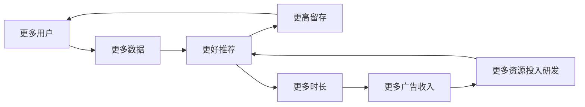

**关键决策**：
1. **技术驱动**：投入重资源研发推荐算法，建立强大的数据中台
2. **内容生态**：头条号创作者平台，解决内容供给问题
3. **增长飞轮**：更多用户→更多数据→更好推荐→更多用户

**结果**：
- 今日头条 DAU 从 0 到 1 亿用了 4 年
- TikTok 从 0 到 1 亿只用了 2 年
- 字节跳动估值超过 3000 亿美元

**关键洞察**：产品经理要有"第一性原理"思维，找到问题的本质解，而不是在存量竞争中内卷。

---

### 案例二：拼多多——社交电商的裂变奇迹

**背景**：2015 年，电商市场已经被淘宝、京东垄断，所有人都认为"电商格局已定"。

**核心洞察**：黄峥发现：中国有大量价格敏感用户，他们对品牌溢价不敏感，但对"占便宜"有强烈心理需求。

**解决方案**：

| 策略 | 具体做法 | 效果 |
|------|----------|------|
| 拼团模式 | 用户发起拼团，分享给好友，一起买更便宜 | 低成本获客 |
| 极致低价 | 压缩渠道层级，直接对接工厂（C2M） | 价格优势 |
| 微信裂变 | 利用微信社交关系链，让用户自发传播 | 病毒式增长 |
| 游戏化 | 多多果园、砍一刀等玩法 | 提升粘性 |

**结果**：
- 用 3 年时间做到 5 亿用户
- 2018 年纳斯达克上市
- 市值一度超越京东

**关键洞察**：不要在巨头擅长的领域正面竞争。找到被忽视的细分人群，用创新的产品形态满足他们的特殊需求。

---

### 案例三：微信——克制的产品哲学

**背景**：微信 2011 年上线，如今日活超过 12 亿，是中国最大的社交平台。

**核心洞察**：张小龙的独特之处在于"克制"。他深知产品经理最大的挑战不是"做什么"，而是"不做什么"。

**克制案例**：

| 决策 | 说明 | 背后逻辑 |
|------|------|----------|
| 不做朋友圈广告 | 直到 8 年后才开放朋友圈广告 | 保护用户体验 |
| 不做信息流 | 坚持公众号的订阅模式，而非算法推荐 | 尊重用户选择 |
| 小程序克制 | 不做应用商店，不做分发，不做排名 | 去中心化生态 |
| 不显示已读 | 不显示消息已读状态 | 减少社交压力 |
| 限制群数量 | 早期限制用户加群数量 | 防止骚扰 |

**结果**：
- 日活超过 12 亿
- 用户渗透率中国第一
- 成为国民级应用

**关键洞察**：少即是多。克制是产品经理的最高境界。不是所有用户需求都要满足，不是所有流量都要变现。

---

### 案例四：Netflix——自我颠覆的勇气

**背景**：Netflix 1997 年成立，最初是 DVD 租赁公司。2007 年开始转型流媒体，如今是全球最大的流媒体平台。

**核心洞察**：颠覆式创新往往来自边缘。主动边缘化自己，而不是等别人来颠覆。

**三次转型**：

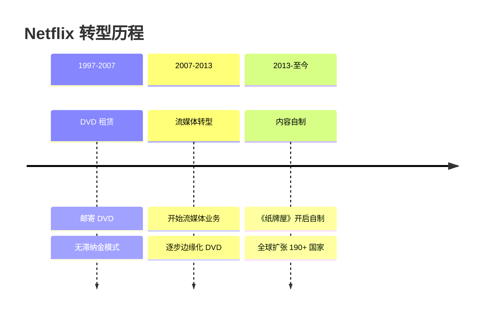

**关键决策**：
1. **DVD 到流媒体**：2007 年，DVD 业务还在赚钱时，决定全力投入流媒体
2. **版权到自制**：2013 年，《纸牌屋》开启内容自制战略
3. **全球扩张**：进入 190+ 国家，本地化内容制作

**结果**：
- 订阅用户超过 2.3 亿
- 市值超过 3000 亿美元
- 成为全球最大的流媒体平台

**关键洞察**：颠覆式创新往往来自边缘。主动边缘化自己，而不是等别人来颠覆。

---

### 案例五：瑞幸咖啡——危机应对与重生

**背景**：2020 年，瑞幸咖啡被曝财务造假 22 亿，从纳斯达克退市，面临破产危机。

**危机应对**：

| 措施 | 具体做法 | 效果 |
|------|----------|------|
| 快速切割 | 第一时间开除涉事高管，断臂求生 | 稳定军心 |
| 坦诚沟通 | 管理层公开道歉，承认错误不甩锅 | 重建信任 |
| 保住核心 | 6000+ 门店正常运营，用户体验不受影响 | 保住基本盘 |
| 产品创新 | 推出爆款产品（生椰拿铁等） | 重获用户 |

**产品力挽救**：
- 门店效率行业领先
- 单杯成本持续优化
- 数字化能力保持优势
- 产品创新不断

**结果**：
- 2023 年实现盈利
- 2024 年重新上市
- 门店数量超过 6000 家

**关键洞察**：危机公关的核心是可信度。产品是企业的根本，产品力可以穿越周期。

---

## 八、实战建议：6 条黄金法则

### 法则一：需求评审技巧

**评审前**：
1. **会前 1v1 沟通**：提前和关键 stakeholders 单独沟通，获取支持
2. **准备 Q&A 预案**：预判可能被挑战的点，准备好答案
3. **明确决策人**：确保决策人在场，避免议而不决

**评审中**：
1. **先讲背景和目标**：让大家理解"为什么做"
2. **再讲方案**：然后才是"怎么做"
3. **记录问题**：不要当场争论，记录问题会后解决

**评审后**：
1. **会议纪要**：24 小时内发出会议纪要
2. **跟进问题**：跟踪未决问题的解决
3. **确认排期**：与开发确认开发排期

---

### 法则二：优先级排序

**RICE 方法**：

| 因素 | 说明 | 评分标准 |
|------|------|----------|
| Reach（覆盖） | 影响多少用户 | 1-10 分 |
| Impact（影响） | 影响程度多大 | 1-10 分 |
| Confidence（信心） | 有多大把握 | 10%-100% |
| Effort（投入） | 需要多少工作量 | 人天 |

**公式**：优先级分数 = (R × I × C) / E

**MoSCoW 方法**：

| 分类 | 说明 | 示例 |
|------|------|------|
| Must have | 必须有，否则无法上线 | 核心功能 |
| Should have | 应该有，但可以延后 | 重要但不紧急 |
| Could have | 可以有，锦上添花 | 优化体验 |
| Won't have | 这次不做 | 明确排除 |

---

### 法则三：跨部门协作

**与设计协作**：
1. 提前沟通设计方向
2. 提供竞品参考
3. 尊重设计专业意见
4. 及时反馈但不随意改稿

**与开发协作**：
1. 需求文档清晰完整
2. 提前技术评估
3. 不随意变更需求
4. 理解技术难处

**与测试协作**：
1. 明确验收标准
2. 提供测试用例
3. 及时响应问题
4. 不压缩测试时间

**与运营协作**：
1. 提前同步上线计划
2. 提供运营素材
3. 配合运营活动
4. 关注运营反馈

---

### 法则四：用户反馈处理

**反馈分类**：

| 类型 | 处理方式 | 示例 |
|------|----------|------|
| Bug 反馈 | 优先修复 | "点击按钮没反应" |
| 体验问题 | 评估影响范围 | "这个流程太复杂" |
| 功能需求 | 评估价值 | "希望能增加 XX 功能" |
| 吐槽抱怨 | 安抚情绪 | "太难用了" |

**处理流程**：

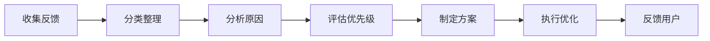

**关键原则**：
1. 追问 5 个为什么，找到本质问题
2. 归类分析，发现共性问题
3. 量化影响范围，优先处理影响大的
4. 及时反馈用户，形成闭环

---

### 法则五：项目风险管理

**风险识别**：

| 风险类型 | 示例 | 应对方案 |
|----------|------|----------|
| 技术风险 | 技术方案不可行 | 提前技术预研 |
| 资源风险 | 人力不足 | 提前申请资源 |
| 依赖风险 | 依赖方延期 | 建立备选方案 |
| 需求风险 | 需求变更 | 控制变更流程 |

**风险管理流程**：

1. **建立风险清单**：列出所有可能的风险
2. **评估风险等级**：概率 × 影响
3. **制定应对方案**：规避、转移、减轻、接受
4. **定期风险 review**：每周更新风险状态
5. **及时升级预警**：高风险及时上报

---

### 法则六：向上管理

**周报技巧**：
1. **简明扼要**：一页纸说清楚
2. **结构化**：进展、问题、计划
3. **数据支撑**：用数据说话
4. **带着方案提问题**：不要只抛问题

**同步节奏**：

| 场景 | 频率 | 内容 |
|------|------|------|
| 常规进展 | 每周 | 本周进展、下周计划、风险问题 |
| 关键节点 | 即时 | 里程碑达成、重大风险 |
| 求助支持 | 即时 | 需要上级协调的资源 |

**关键原则**：
1. 定期同步进展，不让上级"意外"
2. 主动汇报风险，不要等问题爆发
3. 争取资源支持，不要硬扛
4. 理解上级目标，对齐期望

---

## 九、国内消费者洞察

中国消费者有独特的行为特征，理解这些特征对产品设计至关重要。

### 特征一：价格敏感型消费

**核心特点**：
- 追求性价比，"便宜又好的感觉"最重要
- 比价行为普遍，多个平台对比
- 促销敏感度高，双 11、618 囤货

**产品启示**：
1. 价格展示要清晰，避免隐藏费用
2. 提供比价工具或价格保护
3. 设计有吸引力的促销活动
4. 强调"超值"感知

**成功案例**：拼多多、直播带货的崛起

---

### 特征二：社交驱动消费

**核心特点**：
- 微信生态是关键消费场景
- KOL/KOC 推荐影响大
- 分享即信任背书

**产品启示**：
1. 设计社交分享机制
2. 利用 KOL/KOC 种草
3. 建立用户社群
4. 设计裂变玩法

**成功案例**：拼多多拼团、小红书种草

---

### 特征三：移动端优先

**核心特点**：
- 几乎所有消费行为都在手机上完成
- 移动支付渗透率全球第一
- 碎片化使用场景

**产品启示**：
1. 移动端体验优先
2. 简化操作流程
3. 适配多种屏幕
4. 优化加载速度

**成功案例**：超级 APP（微信、支付宝）

---

### 特征四：国货品牌崛起

**核心特点**：
- Z 世代对国货接受度显著提升
- 不再盲目崇拜外国品牌
- 文化自信增强

**产品启示**：
1. 挖掘国潮元素
2. 强调国货品质
3. 讲好品牌故事
4. 符合年轻人审美

**成功案例**：李宁、完美日记、花西子

---

### 特征五：即时满足需求

**核心特点**：
- 对即时配送有极高要求
- 30 分钟送达成为标配
- 耐心越来越低

**产品启示**：
1. 优化配送时效
2. 提供实时进度
3. 设计即时反馈
4. 减少等待焦虑

**成功案例**：美团外卖、叮咚买菜

---

### 特征六：内容消费升级

**核心特点**：
- 从图文到短视频到直播
- 用户注意力碎片化
- 娱乐化内容受青睐

**产品启示**：
1. 短视频是流量入口
2. 直播电商常态化
3. 内容娱乐化
4. 降低理解门槛

**成功案例**：抖音、快手、淘宝直播

---

## 十、书单与资源推荐

### 产品思维

| 书名 | 作者 | 推荐理由 |
|------|------|----------|
| 《启示录》 | Marty Cagan | 产品管理经典 |
| 《用户体验要素》 | Jesse James Garrett | 产品设计框架 |
| 《设计心理学》 | Don Norman | 理解用户心理 |
| 《About Face》 | Alan Cooper | 交互设计圣经 |

### 数据分析

| 书名 | 作者 | 推荐理由 |
|------|------|----------|
| 《精益数据分析》 | Alistair Croll | 数据驱动实战 |
| 《增长黑客》 | Sean Ellis | 增长方法论 |
| 《数据科学实战》 | Cathy O'Neil | 数据科学入门 |

### 商业战略

| 书名 | 作者 | 推荐理由 |
|------|------|----------|
| 《从 0 到 1》 | Peter Thiel | 创业思维 |
| 《好战略坏战略》 | Richard Rumelt | 战略思维 |
| 《商业模式新生代》 | Alexander Osterwalder | 商业模式框架 |

### 在线资源

- **人人都是产品经理**：国内最大产品经理社区
- **PMCAFF**：产品经理交流平台
- **Medium**：海外产品文章聚合
- **Lenny's Newsletter**：顶级产品通讯

---

## 写在最后

产品经理的成长是一场马拉松，不是短跑。每个阶段都有明确的能力要求和成长目标，关键是：

- **保持好奇心**：持续学习，保持对新技术、新趋势的敏感
- **回归用户价值**：任何时候都要问"用户真正想要什么"
- **数据驱动决策**：用数据验证假设，用数据发现机会
- **保持克制**：少即是多，不是所有需求都要满足

愿你在产品经理的道路上，越走越远，成为真正能创造用户价值的产品人。

---

*本文基于「产品经理成长指南」静态网站内容整理，原文包含更多详细内容和 35+ 案例库，欢迎深入学习。*

---

## 配图与排版建议

**配图建议**：
1. 封面图：简洁的产品经理工作场景插画
2. 成长路径图：用时间线展示 5 个阶段
3. 能力雷达图：8 大核心能力可视化
4. 案例卡片：各公司 Logo+ 关键数据
5. 数据图表：AARRR 漏斗、留存曲线等

**排版建议**：
1. 使用微信公众号编辑器，配合卡片样式
2. 关键金句用引用格式突出
3. 表格统一样式，适配移动端阅读
4. 长文添加目录，方便跳转
5. 适当使用 emoji，增加可读性

**发布建议**：
1. 可分上下篇发布，避免文章过长
2. 添加话题标签：#产品经理 #职场成长 #数据分析
3. 文末添加互动话题，引导评论
4. 配合视频号/直播，形成内容矩阵
