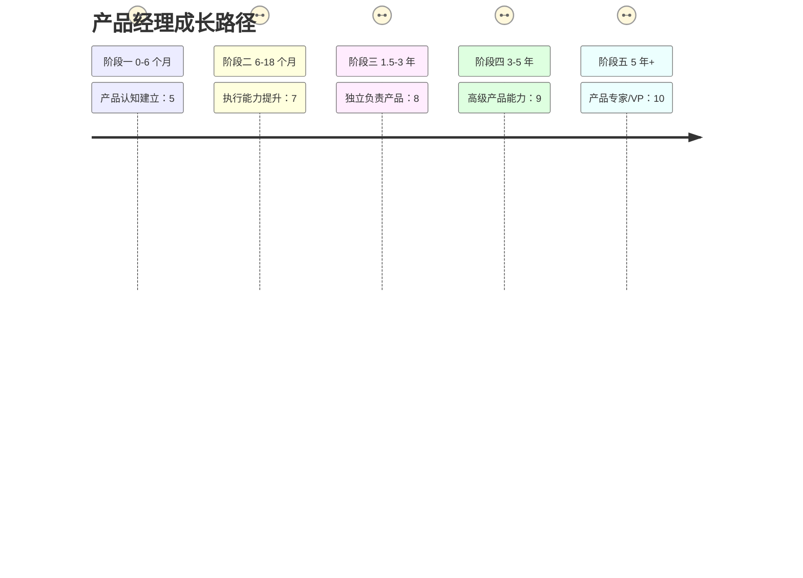
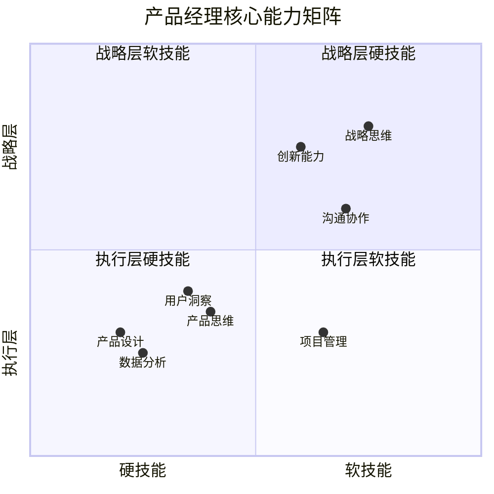
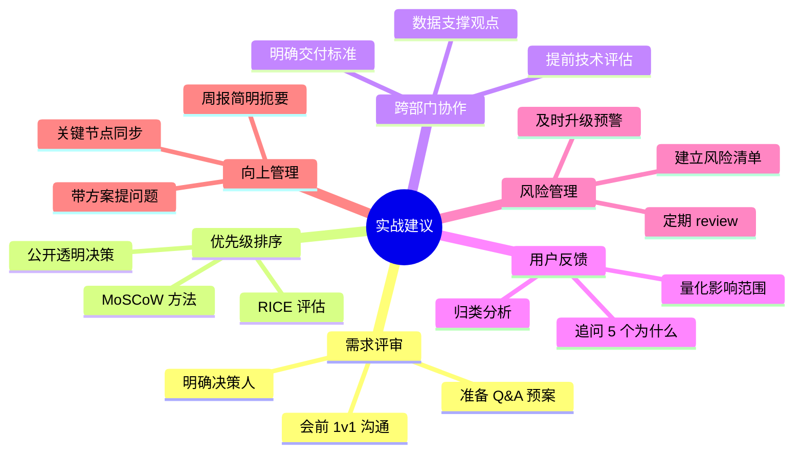

# 优秀产品经理成长指南：从新手到专家的进阶之路

## 写在前面

在移动互联网进入存量竞争的今天，产品经理这个角色比以往任何时候都更加重要。本文系统梳理了产品经理从新手到专家的成长路径、核心能力模型和实战方法论，希望能给正在路上的你一些启发。

---

## 一、成长路径：5 个阶段清晰规划

产品经理的成长不是一蹴而就的，而是需要经历从认知建立到战略思维的完整进阶：



**每个阶段有关键任务：**

| 阶段 | 时间 | 核心任务 |
|------|------|----------|
| 阶段一 | 0-6 个月 | 完成首个产品全流程，独立撰写 5+ 需求文档，进行 10+ 用户访谈 |
| 阶段二 | 6-18 个月 | 独立负责 1-2 个功能模块，主导 3+ 需求评审，完成 A/B 测试全流程 |
| 阶段三 | 1.5-3 年 | 独立负责完整产品线，制定季度/年度规划，建立产品指标体系 |

---

## 二、第一性原理：回归本质的思考方式

第一性原理是产品经理最重要的思维工具之一。它要求我们**剥离表面现象，找到核心本质，从零开始构建解决方案**。

### 经典案例

**乔布斯设计 iPhone**：没有问"手机应该有什么功能"，而是问"手机最本质的功能是什么"。于是回归到"通讯"和"屏幕交互"，去掉多余按键，最大化屏幕体验。

**马斯克造火箭**：没有问"火箭应该多贵"，而是问"火箭的本质是什么，能不能更便宜"。拆解成本后发现原材料只占 2%，于是用可回收火箭颠覆了航天业。

### 思考步骤


---

## 三、用户共情：理解用户真正的痛点

共情不是"我觉得用户需要什么"，而是**站在用户的角度，感受他们的情绪，理解他们的需求**。

### 核心方法

1. **同理心地图**：还原用户全貌——用户看到什么？听到什么？想到什么？感受到什么？
2. **用户旅程地图**：绘制从发现到离开的全流程，找出情绪低谷和高峰
3. **用户访谈技巧**：开放式提问，多问"能具体讲讲吗"，记录原话和情绪

### 重要洞察

> 用户嘴上说的往往是期望，不是真实行为。要看用户实际怎么做，而不是怎么说。

---

## 四、核心能力模型：8 大能力缺一不可



---

## 五、数据分析：用数据驱动决策

数据是产品优化的依据，是决策的底气。**凭感觉做产品是赌博，用数据说话是专业。**

### AARRR 海盗模型

```mermaid
funnel
    title 用户增长漏斗
    "获取 Acquisition" : 10000
    "激活 Activation" : 5000
    "留存 Retention" : 2500
    "收入 Revenue" : 1000
    "推荐 Referral" : 300
```

### 关键要点

- **北极星指标**：唯一最重要的指标
- **漏斗分析**：找到流失环节，问"哪里漏了？为什么漏？"
- **A/B 测试**：控制组 vs 实验组，唯一变量，等待统计显著
- **警惕数据陷阱**：相关≠因果，警惕虚荣指标，结合业务判断

---

## 六、AI 时代：产品经理的新能力要求

AI 正在重塑产品形态，产品经理需要掌握新的能力：

| 能力维度 | 关键技能 |
|---------|---------|
| AI 技术理解 | 机器学习、大语言模型、RAG 架构 |
| AI 产品设计 | Prompt 设计、人机协作、容错机制 |
| 数据工程 | 数据清洗、特征工程、数据标注 |
| 伦理合规 | 隐私保护、算法公平、透明可解释 |

---

## 七、经典案例洞察

### 字节跳动：算法驱动的增长飞轮

今日头条 DAU 从 0 到 1 亿用了 4 年，TikTok 只用 2 年。核心洞察：**算法推荐不是功能创新，而是范式革命。**

增长飞轮：更多用户→更多数据→更好推荐→更多用户

### 拼多多：社交电商的裂变奇迹

用 3 年做到 5 亿用户。核心洞察：**找到被忽视的细分人群，用创新产品形态满足特殊需求。**

- 拼团模式：用户发起拼团，分享给好友，一起买更便宜
- 极致低价：C2M 模式，直接对接工厂
- 微信裂变：利用社交关系链，让用户自发传播

### 微信张小龙：克制的产品哲学

微信日活超 12 亿。核心洞察：**产品经理最大的挑战不是"做什么"，而是"不做什么"。**

- 不做朋友圈广告：直到 8 年后才开放
- 不做信息流：坚持公众号的订阅模式
- 小程序的克制：不做应用商店，不做分发，不做排名

---

## 八、实战建议：6 条黄金法则



---

## 九、国内消费者洞察

中国消费者有独特的行为特征，理解这些特征对产品设计至关重要：

1. **价格敏感型消费**：追求性价比，"便宜又好的感觉"最重要
2. **社交驱动消费**：拼团、分享、种草是重要驱动力
3. **移动端优先**：几乎所有消费行为都在手机上完成
4. **国货品牌崛起**：Z 世代不再盲目崇拜外国品牌
5. **即时满足需求**：30 分钟送达成为标配
6. **内容消费升级**：短视频、直播成为流量入口

---

## 写在最后

产品经理的成长是一场马拉松，不是短跑。每个阶段都有明确的能力要求和成长目标，关键是：

- **保持好奇心**：持续学习，保持对新技术、新趋势的敏感
- **回归用户价值**：任何时候都要问"用户真正想要什么"
- **数据驱动决策**：用数据验证假设，用数据发现机会
- **保持克制**：少即是多，不是所有需求都要满足

愿你在产品经理的道路上，越走越远，成为真正能创造用户价值的产品人。

---

*本文基于「产品经理成长指南」静态网站内容整理，原文包含更多详细内容和 35+ 案例库，欢迎深入学习。*

---

## 配图与排版建议

**配图建议：**
1. 封面图：简洁的产品经理工作场景插画
2. 成长路径图：用时间线展示 5 个阶段
3. 能力雷达图：8 大核心能力可视化
4. 案例卡片：各公司 Logo+ 关键数据

**排版建议：**
- 使用微信公众号编辑器，配合卡片样式
- 关键金句用引用格式突出
- 图表用清晰配色，适配移动端阅读
